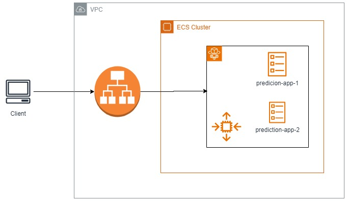

## Context

We need to enable an API where they can query the delay prediction of a flight.

## Part I: Model

After an analysis of the data using the notebook provided in `exploration.ipynb`, it was decided to use the xgb_model_2 model. Analyzing these precision and recall metrics for classes 0 and 1, the value 'THRESHOLD = 0.69' was defined as the parameter of the XGBoost classifier after testing how the model behaved. Since the Class 1 recall was 0.69, it is already quite high. However, Class 1 recall will be further prioritized.

the transcription of this model also uses the singleton design pattern, to improve the instantiation time of the classes.

## Part II: API Creation

A simple api with 2 endpoints is completed:

- `/health`: API health check
- `/predict`: Return predictions.

A simple api with 2 endpoints is completed. 

We also included some validations with pydantinc for the payloads. 

As improvements I propose to use cache to improve the response time of the common predictions. 

## Part III: Deploy to AWS ECS

The deployment of this API on AWS ECS is meticulously designed to ensure unwavering availability. It operates across distinct Docker instances, orchestrated and managed efficiently to handle incoming traffic through a load balancer.

Here is a high level design:

This architectural design not only ensures robustness but also offers scalability by enabling horizontal scaling during periods of intensified traffic, thereby optimizing performance.

## Part IV: CI/CD

The GitHub Actions responsible for orchestrating the build, testing, and deployment processes to AWS as part of our CI/CD pipeline have been successfully implemented and finalized
